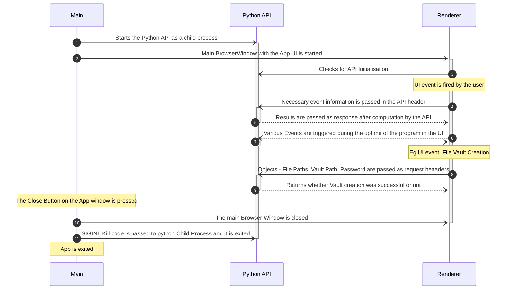

# **Project Leɘk** &middot;    [](https://www.codefactor.io/repository/github/suryansh-23/project-leek) 
## Motivation for The Project
With the pool of information all over the globe increasing each second with every social media post , video , document or any multimedia file. The need for an open source tool developed solely to fulfill this purpose of an _**encrypted medium of transfer of information**_ motivated us to start this project. Our main vision is to enable a utility that can serve various tasks and objectives in a single software suite that is _**FOSS (Free and Open Source Software)**_. With our diverse cryptographic functions anyone with minimum knowledge can find very useful applications and protect his/her precious information. Thus, we intend to bring awareness to the common man about the highly unknown domain of cryptography. 
## **What Can You Do with Project Leɘk**
-	Project Leɘk can be used for demonstration purposes and spread awareness among people about cryptography and its uses.
-	Users can safely store and securely transfer sensitive documents on a possibly compromised machine. 
-	The software can be used conveniently to transmit secret messages over unsecure channels.
## **Installation**
Currently we are only supporting Windows but future updates would include MacOS and Linux. The users willing to test **Project Leɘk** on their machines can head over to [Releases Page](https://github.com/Suryansh-23/Project-Leek/releases) and download the zip file. Then after unzipping the file you are good to run the **Project Leɘk.exe** in the folder. That's it and you are free to take the app anywhere you want it.
## **Features of this project**
- Advanced Encryption Standard 128, 192, and 256 bit encryption and decryption
- Image based Steganography using LSB algorithm
- AES based Portable File Vault without Size Limits

## **Contributing** 
This project is created while keeping user privacy and security in mind. So please feel free to suggest any changes, bugs or security issues you find while using. You can create a Issue in this Github Repo, or you can create a PR for the same. Your contribution will be taken into consideration as early as possible. 
For Contributing you can look out to the following repositories -
- Main Repo - https://github.com/Suryansh-23/Project-Leek
- File Vault Repo - https://github.com/Suryansh-23/File-Vault-Desktop


# How does this Work ?
## Tech Stack 
The Tech Stack we've used in this Project and its subsidiary repo are the following - 
- `Electron` - For Building a Cross-Platform Desktop App
- `Python` - For Major Backend API to use for cryptographic functions to be called by the frontend
- `React` - For Managing Frontend and State of the UI
- `TypeScript` - Used with React and Electron in the App 

## Process Sequence 
The following is a sequence diagram for the lifecycle of events in the project sequentially -


## **`Main.py` file**
### Imports
The Main.py file starts by importing the local modules for the necessary functionalities like the AES Module, Steganography and the Encode for the File Vault. After that, the required built-in packages are imported like the random package for generating a random alpha-numeric auth key, string package for the alpha-numeric characters, JSON for translating JSON objects in python dictionaries, zip file for unzipping the Zipped File-Vault App, os package for file-path related functions. Then the flask package is imported for the API.

### Helper Functions 
The file also contains some helper functions like random_key, str2hex and hex2str for generating a random alpha-numeric Auth Key for authentication purposes, converting an ASCII string to hex & vice-versa respectively.
 
### Routes & Working
After initializing the Flask App, some certain endpoints or routes are defined for communication with the frontend which take in parameters via HTTP-Headers. The following are the routes defined in the API –

- `home`
This is a standard API route for testing if the API is online or not. This endpoint can be reached but the frontend for ensuring proper connectivity with the API.

- `cipher_key`
This endpoint is used to fetch a standard private key that the user can use to perform the AES Encryption. This endpoint requires the frontend to send the Encryption-Type through the headers for obtaining a key of the required length. This also works as a random Pass-Key generator for the file-vault functionality.

- `aes_encryption`
This endpoint is responsible for performing the AES-Encryption on the String, Private Key passed using the API headers along with the type of AES Encryption (128, 192 or 256–bit). Here the code uses the helper functions to interconvert string to hex and vice versa and then return the results obtained using the aes_encrypt class in the form of a JSON object.

- `aes_decrypt`
This endpoint is similar to the previous route but instead of using the aes_encrypt class, it uses the aes_decrypt class and also checks if the string to decrypt is in hex form or just an ASCII string. This route also returns a JSON object.

- `file_vault`
This API route takes in the password, path for saving the vault, paths of the Files to add to the Vault in the request headers. Then it uses the ZipFile module functions to extract the file-vault app at the path provided. Then it uses the Vault Class from the Encoder.py file to create a pickle file containing the required files in a binary format and save that pickle file at the given path.

- `stegano_encryption`
This endpoint accepts a list containing the Image Paths and the String for performing Steganography using the stegano_encrypt class and then saves each file as a copy with a “_Encrypted” added at last. This route returns True or False depending on whether the operation was successful or not.

- `stegano_decrypt`
This endpoint is similar to the previous endpoint but instead of the encryption, it performs decryption with the Images obtained from the Image Paths using the stegano_decrypt class provided in the headers. 

## **`Encoder.py` File**
The Encoder.py starts by importing some standard packages like os, pickle and shutil for doing file system related tasks.
Then a Class Vault is created that includes the following methods:

- `tree_parser`
This method takes in the path of the root directory and the paths of the file and generates a Dictionary containing the file structure with all the files having an absolute path. 

- `create_vault`
This method is used to create an empty vault for loading the required data.

- `fill_vault`
This method takes in the tree object and the path for the root directory. Then it loops over the tree while checking for the condition if the current value is a directory or not, if not, then it adds their binary data into the vault object.

- `main`
This is the main process loop that calls all the methods and generates a well formatted vault object that is then stored in a pickle file in the given path

## **`File-Vault/Vault.py` File**
The Vault.py file starts by importing the required built-in packages like the random package for generating a random alpha-numeric auth key, string package for the alpha-numeric characters, JSON for translating JSON objects in python dictionaries and vice-versa, os package for file-path related functions, pickle for reading pickle objects, mimetypes for classifying files. Then the flask package is imported for the API.

### Helper Functions
- `random_key`
This function is used for generating a random alpha-numeric Auth Key for authentication purposes.

- `manipulate`
This function is used to convert the standard python data structure hash table to a formatted object consumable by the js frontend

- `download_multiple`
This function accepts a dictionary of the file names, a list of frontend-based arguments that are passed due to the tree view of data. This then traverses the dictionary and saves the files that are part of the whitelist in the directory provided.

- `download_vault`
This function works similarly to the previous function, but it saves all the files at a particular path according to the file structure of the vault.

### Routes & Working 
- `home`
This is a standard API route for testing if the API is online or not. This endpoint can be reached but the frontend for ensuring proper connectivity with the API.

- `auth` 
This API Route is for Authentication with the correct frontend client. It Gets the Pass-Key in the request header and then checks if the Pass-Key is correct, if correct it sets the global variable AUTH to Auth Key generated by random_key and sends the Auth-Key string to the frontend.

- `tree`
This API Route sends directory structure object (Formatted) to the frontend if the correct Auth-Key is present. The returned object is jsonified for making it usable within the frontend.

- `keys` 	
This API Route sends the keys of the hash map of the file structure of the vault in a JSON format to the frontend if the Auth-Key passed in the header is correct.

- `save, save_many & save_all`
These routes perform the function of saving the required file at the provided path given that the Auth-Key given is correct. The Files are selected over the frontend for save and save_many and passed in the request header.


## `AES.py` file
AES.py contains several functions that are standard practice for implementing the algorithm in the aes_encrypt and the aes_decrypt classes. These functions are:
- AddRoundKeys
- MixColumns
- SubBytes
- ShiftRows
### `Add Round Keys` Method
This function is used to add the extended keys each round. The extended keys are prepared from the given key using the key_conversion() function. The key conversion algorithm works on the following steps. First, the given key is considered as the first round key and split into four words. For each subsequent round, the key is given be XORing the key before it and the key at the same position in the round before. The first key of every round cannot be given by this method, and is instead given by XORing the first word of the round before, the third word of the round before round shifted by two characters to the right, and a constant value that is given for each round. Each word is then XORed with each byte of the state.
### `MixColumns` Method
This function multiplies the state values by a polynomial. In practice it is implemented using matrix multiplication where the state is multiplied to a matrix and hence the new column is formed. For this implementation, the multiplication function uses static values rather than calculating the multiplication for each byte, saving time and making the algorithm more efficient.
### `SubBytes` Method
The SubBytes function is a simple function that subs out the every byte according to a lookup table called Rjindael S-box. 
### `ShiftRows` Method
The ShiftRows function is a function that round shifts every row according to its row number. So the first row isn't shifted at all, the second row is shifted by one place and so on. The rows are shifted to the right in encryption and to the left in decryption.
### **Using the `encrypt()` and `decrypt()` functions**
To use the encrypt() and decrypt() functions, an object must first be created using the aes_encrypt or aes_decrypt class as shown.
```enc_obj = aes_encrypt(cipherkey, plaintext, mode)``` where the mode is 0,1,2 for 128,192,256 bit AES respectively and plaintext and cipherkey must be entered as a hexadecimal string with '0x' prefix only once at the beginning of the string. For example, a valid plaintext is ```'0x1234567890abcde'```. The plaintext can encrypted as ```enc_text = enc._obj.encrypt()```
The same procedure is to be followed for making the decrypt object and the decrypt function.
## **`Stegano.py` file**
Stegano.py is a simple, Least Significant Bit based algorithm that encodes a message into an image. The algorithm gets all the pixel values, and converts every character in the given message to binary. For every 1 in the message, the corresponding pixel is made odd and for every 0 in the message the corresponding pixel is made even. Every 8th pixel is made to be 0 if the message continues and 1 if the message has terminated. 
This algorithm works the best when the image is large compared to the message to be encoded. 
### **Using the `encrypt()` and `decrypt()` functions**
To use the encrypt and dectrpy functions for the steganography algorithm, an object must first be created using the ```stegano_encrypt``` and ```stegano_decrypt``` classes. The correct way of declaring the object is ```st_obj = stegano_encrypt(data,img,fp)``` where data is the message to be encoded as a string literal, img is the image address for the image and fp is the file path where the image is to be saved. The message is encoded using ```st_obj.encrypt()``` function.
Decryption can be done using similar steps with the exception that there are no data or fp parametes in the decrypt class, only the image address needs to be given.
