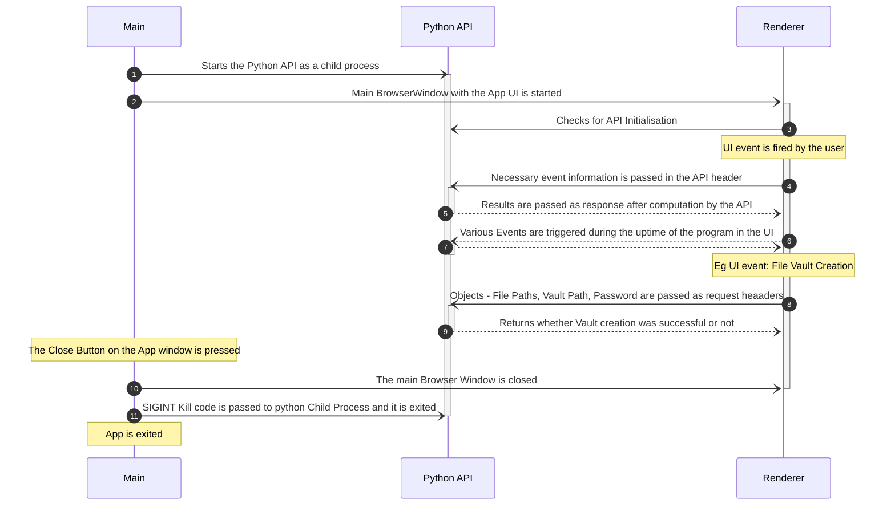

# **Project Leɘk** &middot;    [](https://www.codefactor.io/repository/github/suryansh-23/project-leek) 
## Motivation for The Project
With the pool of information all over the globe increasing each second with every social media post , video , document or any multimedia file. The need for an open source tool developed solely to fulfill this purpose of an _**encrypted medium of transfer of information**_ motivated us to start this project. Our main vision is to enable a utility that can serve various tasks and objectives in a single software suite that is _**FOSS (Free and Open Source Software)**_. With our diverse cryptographic functions anyone with minimum knowledge can find very useful applications and protect his/her precious information. Thus, we intend to bring awareness to the common man about the highly unknown domain of cryptography. 
## **What Can You Do with Project Leɘk**
-	Project Leɘk can be used for demonstration purposes and spread awareness among people about cryptography and its uses.
-	Users can safely store and securely transfer sensitive documents on a possibly compromised machine. 
-	The software can be used conveniently to transmit secret messages over unsecure channels.
## **Installation**
Currently we are only supporting Windows but future updates would include MacOS and Linux. The users willing to test **Project Leɘk** on their machines can head over to [Releases Page](https://github.com/Suryansh-23/Project-Leek/releases) and download the zip file. Then after unzipping the file you are good to run the **Project Leɘk.exe** in the folder. That's it and you are free to take the app anywhere you want it.
## **Features of this project**
- Advanced Encryption Standard 128, 192, and 256 bit encryption and decryption
- Image based Steganography using LSB algorithm
- AES based Portable File Vault without Size Limits
## **Contributing** 
This project is created while keeping user privacy and security in mind. So please feel free to suggest any changes, bugs or security issues you find while using. You can create a Issue in this Github Repo, or you can create a PR for the same. Your contribution will taken into consideration as early as possible


# How does this Work ?
## Tech Stack 
The Tech Stack we've used in this Project and its subsidiary repo are the following - 
- `Electron` - For Building a Cross-Platform Desktop App
- `Python` - For Major Backend API to use for cryptographic functions to be called by the frontend
- `React` - For Managing Frontend and State of the UI
- `TypeScript` - Used with React and Electron in the App 

## Process Sequence 
The following is a sequence diagram for the lifecycle of events in the project sequentially -


## **`Main.py` file**
### Imports and Initial Setup
 The code starts by importing the libraries needed to encrypt and decrypt data. The next two lines import a list of choices from random, which is used for generating a string with letters and numbers. Next, ascii_letters and digits are imported so that they can be used in the program.The code then defines some variables: Flask is defined as an object that will hold all of the functions needed to run this application; jsonify turns JSON objects into Python dictionaries; request is defined as an HTTP client object that handles requests made through GET or POST methods; path returns a directory's pathname without its filename extension (e.g., "C:\Users\John" would return "C:"); rename renames one file or directory to another name (e.g., "oldfile" would become "newfile"); ZipFile creates a new zip file containing files from multiple directories; os provides access to operating system commands like rename and path. Next, there are three if statements: If flask was not already created, it will create it using the function flask(); If jsonify was not already created, it will create it using the function jsonify(); If stegano_encrypt() was not already created, it. The code is a Python script that uses the AES encryption algorithm to encrypt and decrypt text. The code above also imports the Steganography and Encoder modules, which are used for stegano-encrypting and stegano-decrypting.
 The code is a function that generates a random key.
 The function takes an integer as input and returns the string of characters that make up the key.
 The code starts by declaring some variables, including AUTH (global variable) for maintaining a valid Auth-Key to be used to verify connection with authenticated clients only, str_pool (a list of all ASCII letters and digits), choices(str_pool, k=k) which is used to generate the string of characters in str_pool using k as an index into str_pool.
 The code generates a random string of alphanumeric characters.
 The generated string is then joined with the key k=16 to form a single string that has 16 digits.
 The output of the code above is "e9d1b7c8".
 The code starts by importing the Flask module.
 
 ### Routes
 Next, a function called home is defined that will handle all requests to the API route.
 The code then defines a variable called app which will be used as an instance of the Flask class.
 Next, two routes are defined: one for testing if the API is online and another for returning some information about our application.
 The code is an example of how to use Flask and the Python programming language.
 The code above is a standard API route for testing if the API is online.
 The code is a function that returns the cipher key.
 The code is trying to figure out what encryption type was sent in the request header, and if it's not 0x then it will use str2hex to convert the string into hexadecimal format.
 The first thing this function does is check for an AES-String in the request headers.
 If there isn't one, then it will return False and 500 as a response with jsonify().
 Next, if there is an AES-String in the request headers, then it will try to parse out what type of encryption was used by checking for "0x" at the beginning of the string.
 If there isn't any "0x", then it assumes that 128 bit encryption was used (because all other values start with "1").
 The code attempts to return the AES-encryption key for a given string.
 The code attempts to return the AES-encryption key for a given string.
 The code starts by getting the user's password.
 The code then uses this password to get a vault path and file paths from the request headers.
 Next, it creates a ZipFile object that is used to store files in the vault.
 The first thing that happens is that if there are no file paths specified, then an error will be returned with 500 status code and False as JSON response data: if string[:2] != "0x": string = str2hex(string) Next, it encrypts any given string using AES-256 encryption algorithm with cipher key of "Cipher-Key" and encryption type of 0 for 128 bit or 1 for 192 bit or 2 for 256 bit: encrypt_type = request.headers.get("Encryption-Type") If the input was not encrypted before (i.e., if it was just plain text), then now we're going to encrypt it using AES-256 algorithm with cipher key of "Cipher-Key" and encryption type of 0 for 128 bit or 1 for 192 bit or 2 for 256 bit: decrypted = aes_decrypt(str2hex(cipher_key), string,
 The code is a sample of how to encrypt and decrypt files using AES.
 The first thing that needs to be done is the creation of the cipher key.
 This can be accomplished by passing in the password as a string, which will then be converted into a hexadecimal string.
 The next step is to create an encryption type value, which will determine what kind of encryption algorithm should be used for encrypting and decrypting the file.
 Once this has been created, it is time to start creating the actual function that will do all of these things for us.
 First we need to create an instance of AES with our desired key size (128 bit or 256 bit).
 Next we need to create an instance of ZipFile, which will
 The code is a simple Python script that will encrypt the contents of a file and then store it in the "Vault" folder.
 The user is prompted for their password, which is stored as plain text in the code.
 The first line imports the necessary libraries to run this program: import os, sys, urllib2, json, time from urllib2 import urlopen #for opening URLs from os import path #for getting paths from json import loads #to parse JSON data from time import sleep #to delay execution by sleeping for 1 second before executing next command
 The code is a Python script that will create a new file called "File-Vault-v1.0.0-win32-x64.zip" and then extract all of the files from it into the folder "C:\Users\Username\Documents\Python".
 The code above will also rename the original "File-Vault-v1.0.0-win32-x64" to "Vault", and then move it to the desired location, which in this case is C:\Users\Username\Documents\.
 The code starts by checking if the request is a GET or POST.
 If it's a GET, then it will return the string "Hello World".
 If it's a POST, then it will check to see if there is an Img-Addr in the headers of the request.
 If there is, then loads(request.headers.get("Img-Addr")) will load that image into memory and for each pixel in that image, stegano_decrypt(img=i) will decrypt one pixel at a time until all pixels are decrypted and stored in main[path.basename(i)] where path refers to what folder on disk was used to store this encrypted file (e.g., "C:\Users\John\Pictures").
 The code starts by creating an empty dictionary called main with keys being paths of folders on disk which were used to store encrypted files (e.g., C:\Users\John\Pictures).
 Then for each pixel in img: stegano_decrypt(img=i) decrypts one pixel at a time until all pixels are decrypted and stored in main[path] where path refers to what folder on disk was used to store this encrypted file (
 The code is used to encrypt a file using the stegano algorithm.
 The code above will return a dictionary of all encrypted files that have been uploaded.

## `AES.py` file
AES.py contains several functions that are standard practice for implementing the algorithm in the aes_encrypt and the aes_decrypt classes. These functions are:
- AddRoundKeys
- MixColumns
- SubBytes
- ShiftRows
### `Add Round Keys` Method
This function is used to add the extended keys each round. The extended keys are prepared from the given key using the key_conversion() function. The key conversion algorithm works on the following steps. First, the given key is considered as the first round key and split into four words. For each subsequent round, the key is given be XORing the key before it and the key at the same position in the round before. The first key of every round cannot be given by this method, and is instead given by XORing the first word of the round before, the third word of the round before round shifted by two characters to the right, and a constant value that is given for each round. Each word is then XORed with each byte of the state.
### `MixColumns` Method
This function multiplies the state values by a polynomial. In practice it is implemented using matrix multiplication where the state is multiplied to a matrix and hence the new column is formed. For this implementation, the multiplication function uses static values rather than calculating the multiplication for each byte, saving time and making the algorithm more efficient.
### `SubBytes` Method
The SubBytes function is a simple function that subs out the every byte according to a lookup table called Rjindael S-box. 
### `ShiftRows` Method
The ShiftRows function is a function that round shifts every row according to its row number. So the first row isn't shifted at all, the second row is shifted by one place and so on. The rows are shifted to the right in encryption and to the left in decryption.
### **Using the `encrypt()` and `decrypt()` functions**
To use the encrypt() and decrypt() functions, an object must first be created using the aes_encrypt or aes_decrypt class as shown.
```enc_obj = aes_encrypt(cipherkey, plaintext, mode)``` where the mode is 0,1,2 for 128,192,256 bit AES respectively and plaintext and cipherkey must be entered as a hexadecimal string with '0x' prefix only once at the beginning of the string. For example, a valid plaintext is ```'0x1234567890abcde'```. The plaintext can encrypted as ```enc_text = enc._obj.encrypt()```
The same procedure is to be followed for making the decrypt object and the decrypt function.
## **`Stegano.py` file**
Stegano.py is a simple, Least Significant Bit based algorithm that encodes a message into an image. The algorithm gets all the pixel values, and converts every character in the given message to binary. For every 1 in the message, the corresponding pixel is made odd and for every 0 in the message the corresponding pixel is made even. Every 8th pixel is made to be 0 if the message continues and 1 if the message has terminated. 
This algorithm works the best when the image is large compared to the message to be encoded. 
### **Using the `encrypt()` and `decrypt()` functions**
To use the encrypt and dectrpy functions for the steganography algorithm, an object must first be created using the ```stegano_encrypt``` and ```stegano_decrypt``` classes. The correct way of declaring the object is ```st_obj = stegano_encrypt(data,img,fp)``` where data is the message to be encoded as a string literal, img is the image address for the image and fp is the file path where the image is to be saved. The message is encoded using ```st_obj.encrypt()``` function.
Decryption can be done using similar steps with the exception that there are no data or fp parametes in the decrypt class, only the image address needs to be given.
