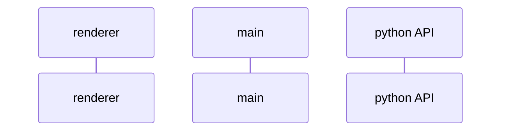

# **Project Leɘk** &middot;    [](https://www.codefactor.io/repository/github/suryansh-23/project-leek) 
## Motivation for The Project
With the pool of information all over the globe increasing each second with every social media post , video , document or any multimedia file. The need for an open source tool developed solely to fulfill this purpose of an _**encrypted medium of transfer of information**_ motivated us to start this project. Our main vision is to enable a utility that can serve various tasks and objectives in a single software suite that is _**FOSS (Free and Open Source Software)**_. With our diverse cryptographic functions anyone with minimum knowledge can find very useful applications and protect his/her precious information. Thus, we intend to bring awareness to the common man about the highly unknown domain of cryptography. 
## **What Can You Do with Project Leɘk**
-	Project Leɘk can be used for demonstration purposes and spread awareness among people about cryptography and its uses.
-	Users can safely store and securely transfer sensitive documents on a possibly compromised machine. 
-	The software can be used conveniently to transmit secret messages over unsecure channels.
## **Installation**
Currently we are only supporting Windows but future updates would include MacOS and Linux. The users willing to test **Project Leɘk** on their machines can head over to [Releases Page](https://github.com/Suryansh-23/Project-Leek/releases) and download the zip file. Then after unzipping the file you are good to run the **Project Leɘk.exe** in the folder. That's it and you are free to take the app anywhere you want it.
## **Features of this project**
- Advanced Encryption Standard 128, 192, and 256 bit encryption and decryption
- Image based Steganography using LSB algorithm
- AES based Portable File Vault without Size Limits
## **Contributing** 
This project is created while keeping user privacy and security in mind. So please feel free to suggest any changes, bugs or security issues you find while using. You can create a Issue in this Github Repo, or you can create a PR for the same. Your contribution will taken into consideration as early as possible


# How does this Work ?
## Tech Stack 
The Tech Stack we've used in this Project and its subsidiary repo are the following - 
- `Electron` - For Building a Cross-Platform Desktop App
- `Python` - For Major Backend API to use for cryptographic functions to be called by the frontend
- `React` - For Managing Frontend and State of the UI
- `TypeScript` - Used with React and Electron in the App 

## Process Sequence 
The following is a sequence diagram for the lifecycle of events in the project sequentially -


## **AES.py file**
AES.py contains several functions that are standard practice for implementing the algorithm in the aes_encrypt and the aes_decrypt classes. These functions are:
- AddRoundKeys
- MixColumns
- SubBytes
- ShiftRows
### **Add Round Keys**
This function is used to add the extended keys each round. The extended keys are prepared from the given key using the key_conversion() function. The key conversion algorithm works on the following steps. First, the given key is considered as the first round key and split into four words. For each subsequent round, the key is given be XORing the key before it and the key at the same position in the round before. The first key of every round cannot be given by this method, and is instead given by XORing the first word of the round before, the third word of the round before round shifted by two characters to the right, and a constant value that is given for each round. Each word is then XORed with each byte of the state.
### **MixColumns**
This function multiplies the state values by a polynomial. In practice it is implemented using matrix multiplication where the state is multiplied to a matrix and hence the new column is formed. For this implementation, the multiplication function uses static values rather than calculating the multiplication for each byte, saving time and making the algorithm more efficient.
### **SubBytes**
The SubBytes function is a simple function that subs out the every byte according to a lookup table called Rjindael S-box. 
### **ShiftRows**
The ShiftRows function is a function that round shifts every row according to its row number. So the first row isn't shifted at all, the second row is shifted by one place and so on. The rows are shifted to the right in encryption and to the left in decryption.
### **Using the encrypt() and decrypt() functions**
To use the encrypt() and decrypt() functions, an object must first be created using the aes_encrypt or aes_decrypt class as shown.
```enc_obj = aes_encrypt(cipherkey, plaintext, mode)``` where the mode is 0,1,2 for 128,192,256 bit AES respectively and plaintext and cipherkey must be entered as a hexadecimal string with '0x' prefix only once at the beginning of the string. For example, a valid plaintext is ```'0x1234567890abcde'```. The plaintext can encrypted as ```enc_text = enc._obj.encrypt()```
The same procedure is to be followed for making the decrypt object and the decrypt function.
## **Stegano.py file**
Stegano.py is a simple, Least Significant Bit based algorithm that encodes a message into an image. The algorithm gets all the pixel values, and converts every character in the given message to binary. For every 1 in the message, the corresponding pixel is made odd and for every 0 in the message the corresponding pixel is made even. Every 8th pixel is made to be 0 if the message continues and 1 if the message has terminated. 
This algorithm works the best when the image is large compared to the message to be encoded. 
### **Using the encrypt() and decrypt() functions**
To use the encrypt and dectrpy functions for the steganography algorithm, an object must first be created using the ```stegano_encrypt``` and ```stegano_decrypt``` classes. The correct way of declaring the object is ```st_obj = stegano_encrypt(data,img,fp)``` where data is the message to be encoded as a string literal, img is the image address for the image and fp is the file path where the image is to be saved. The message is encoded using ```st_obj.encrypt()``` function.
Decryption can be done using similar steps with the exception that there are no data or fp parametes in the decrypt class, only the image address needs to be given.
